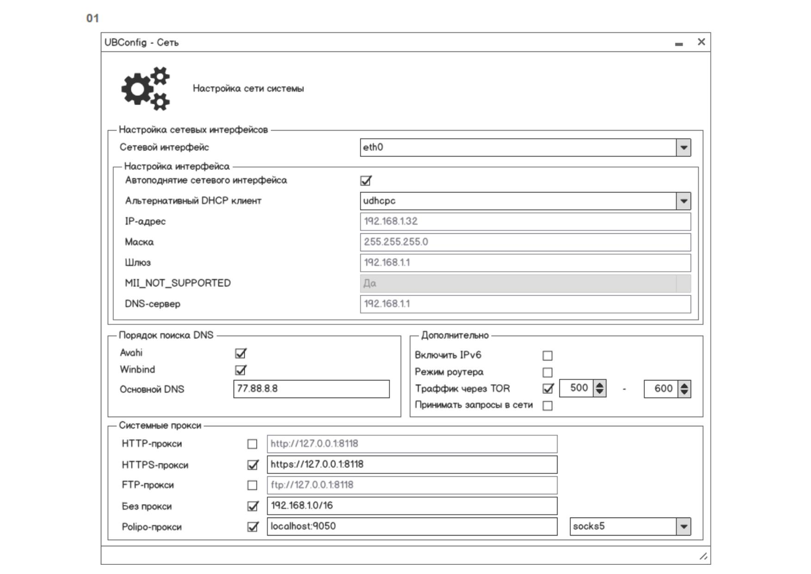

# Network GUI

## В процессе

## Референс

## Ссылки

- [репа](https://gitea.ublinux.ru/Artwork_Applications/design-ubl-settings-apps/src/branch/master/ubl-settings-network)

## TODO
- [ ] Дизайн-макет интерфейса
    - [ ] Продумать все дополнительные окна
        - [ ] Ошибки/успешно/совет и тп
    - [ ] ...
- [ ] Привязать минимальный скрипт с нулевым функционалом
- [ ] Полноценная программа
    - [ ] ...
- [ ] Документация
    - [ ] Установка
    - [ ] Удаление
    - [ ] Обработка ошибок
