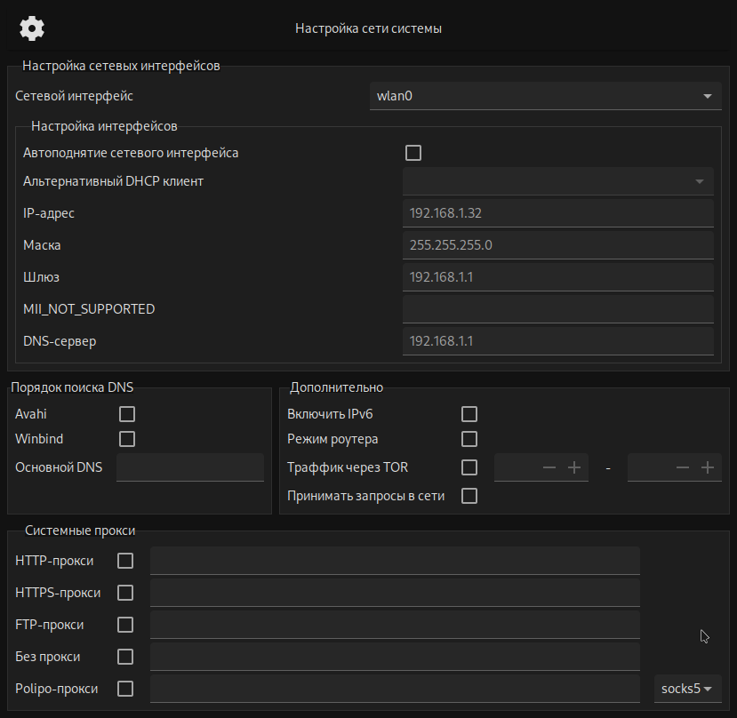
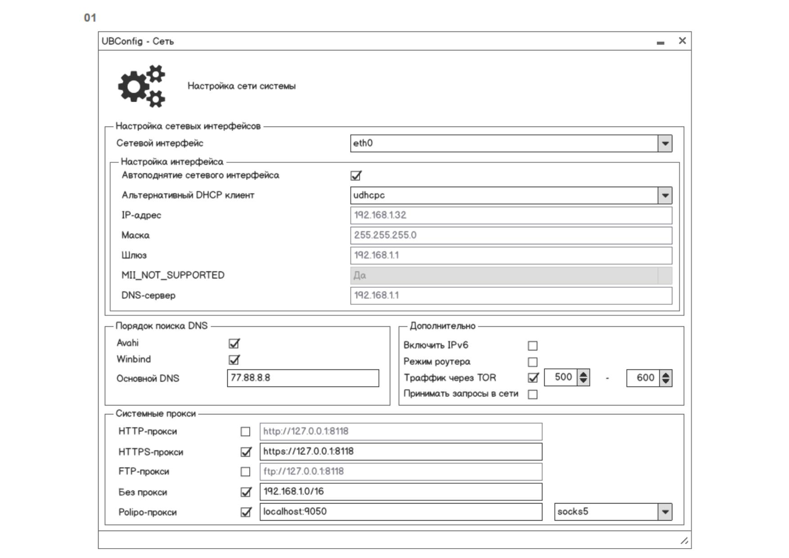

# Network GUI

## В процессе

## Референс

## Ссылки

- [репа](https://gitea.ublinux.ru/Artwork_Applications/design-ubl-settings-apps/src/branch/master/ubl-settings-network)

## TODO

- [ ] Дизайн-макет интерфейса
    - [x] Макет в соответсвии с ТЗ
    - [ ] Дополнительные окна
        - [ ] Ошибки/успешно/совет и тп
    - [ ] ...
- [x] Привязать минимальный скрипт с нулевым функционалом
- [ ] Полноценная программа
    - [ ] Выбор интерфейса с которым работать
      - [x] Парсинг 
      - [x] Выбор из вариантов
      - [ ] Обновление полей в соответствии с настройками интерфейса
    - [ ] Ввод IP адреса
      - [x] Парсинг
      - [x] Попап-хинт при неверном вводе
      - [ ] Валидация при условии, что задана маска и шлюз
      - [ ] nmcli
    - [ ] Ввод маски
      - [x] Валидация с попапом
      - [ ] nmcli
    - [ ] Ввод шлюза
      - [ ] Парсинг
      - [ ] Попап
      - [ ] Валидация при условии, что задана маска и айпи
      - [ ] nmcli
    - [ ] ...
- [ ] Документация
    - [ ] Установка
    - [ ] Удаление
    - [ ] Обработка ошибок
